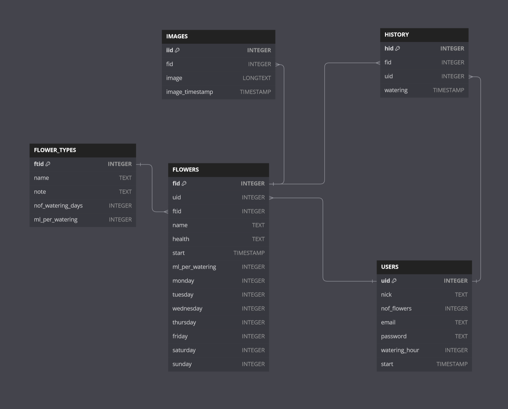

# i-konewka

Innowacyjna konewka do nawadniania roślin, wyposażona w rozpoznawanie gatunku kwiatów poprzez kamerę, to nasz projekt. Dzięki zaawansowanej technologii IoT i rozpoznawania wizyjnego, ma on za zadanie zrewolucjonizować pielęgnację roślin, poprawiając ich zdrowie i wzrost w każdym gospodarstwie domowym. Zaoszczędź czas i stwórz optymalne warunki dla roślin, niezależnie od poziomu doświadczenia – dla ogrodników profesjonalistów i początkujących miłośników zieleni. Podstawowe funkcje obejmują: planowanie podlewania, rozpoznawanie gatunku kwiatów oraz dedykowaną aplikację mobilną.

Cały system składa się z aplikacji mobilnej, którą użytkownik instaluje na swoim smartfonie, urządzenia IoT zawierającego mikroprocesor oraz pompy umożliwiającej podawanie wody roślinom.

## Schemat projektu

## Dokumentacja

### Aplikacja mobilna

Aplikacja Flutter zaprojektowana w celu wsparcia urządzenia do podlewania poprzez dodanie kontroli i logiki. Użytkownik może utworzyć konto, w którym może przechowywać informacje o swoich roślinach, z różnymi atrybutami. Kamera zainstalowana w smartfonie może być używana do identyfikacji kwiatów użytkownika. Dzięki silnikowi identyfikacji roślin i oceny zdrowia dostarczanemu przez API PlantId.

### Połaczenie bluetooth

### API i-konewka

### API PlantId

### API openAI

### Baza danych

W bazie danych znajduje się kilka kluczowych tabel. Pierwsza z nich to "USERS", która przechowuje informacje o użytkownikach. Każdy użytkownik ma unikalny identyfikator (uid), nick, liczbę posiadanych kwiatów (nof_flowers), adres email, hasło, godzinę podlewania (watering_hour), oraz datę rozpoczęcia korzystania z systemu (start).

Drugą istotną tabelą jest "FLOWER_TYPES", która definiuje różne typy kwiatów. Każdy typ ma swój unikalny identyfikator (ftid), nazwę, dodatkowe notatki (note), liczbę dni między podlewaniem (nof_watering_days), oraz ilość mililitrów wody potrzebną do podlania (ml_per_watering).

Kolejna tabela, "FLOWERS", zawiera informacje o konkretnych kwiatach. Każdy kwiat ma swój unikalny identyfikator (fid), przypisanego użytkownika (uid), typ kwiatu (ftid), nazwę, stan zdrowia (health), datę dodania do systemu (start), ilość mililitrów wody na podlewanie (ml_per_watering), oraz informacje o dniach tygodnia, w których należy podlewać (monday, tuesday, ..., sunday).

Historia podlewania kwiatów przechowywana jest w tabeli "HISTORY". Każde podlewanie ma swój unikalny identyfikator (hid), identyfikator kwiatu (fid), identyfikator użytkownika (uid), oraz datę i godzinę podlewania (watering).

Ostatnia tabela, "IMAGES", zawiera informacje o obrazach przypisanych do konkretnych kwiatów. Każdy obraz ma swój unikalny identyfikator (iid), identyfikator kwiatu (fid), sam obraz w formie długiego tekstu (image), oraz datę i godzinę dodania obrazu (image_timestamp).

Wszystkie te tabele są ze sobą powiązane za pomocą kluczy obcych (foreign keys), co umożliwia skonstruowanie spójnej bazy danych, gdzie informacje o użytkownikach, typach kwiatów, konkretnych kwiatach, historii podlewania i obrazach są ze sobą powiązane.

### Fizyczne urządzenie

### Lista potrzebnego sprzętu

### Program zarządzający hardware

## Podziękowania

Chcielibyśmy wspomnieć firmę [kindwise](https://www.kindwise.com/) za udostępnienie nam ich fantastycznego narzędzia [PlantId](https://plant.id/), które znakomicie wzbogaciło nasz projekt. Ich maszynowe rozpoznawanie kwiatów na podstawie obrazów pozwoliło nam poszerzyć zakres zastosowania naszej aplikacji.

We would like to mention [kindwise](https://www.kindwise.com/) companany for providing us
their awesome tool [PlantId](https://plant.id/) which added great functionality to our project.
Their machine learning picture-based flower identification allowed us to widen scope of use of our app.