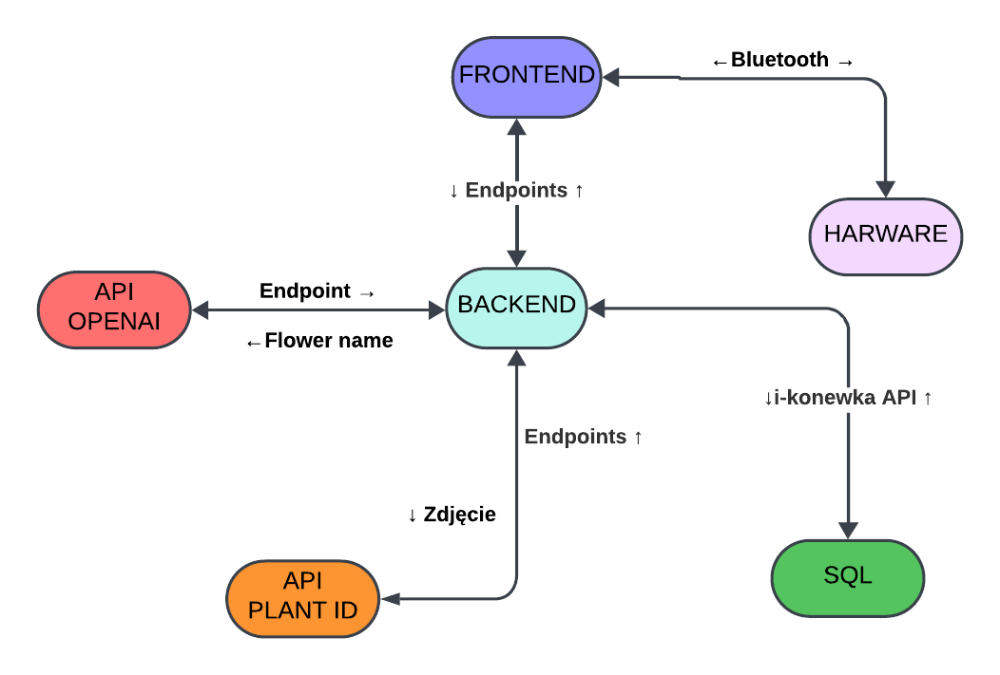

# i-konewka


Innowacyjna konewka do nawadniania roślin, wyposażona w rozpoznawanie gatunku kwiatów poprzez kamerę, to nasz projekt. Dzięki zaawansowanej technologii IoT i rozpoznawania wizyjnego, ma on za zadanie zrewolucjonizować pielęgnację roślin, poprawiając ich zdrowie i wzrost w każdym gospodarstwie domowym. Zaoszczędź czas i stwórz optymalne warunki dla roślin, niezależnie od poziomu doświadczenia – dla ogrodników profesjonalistów i początkujących miłośników zieleni. Podstawowe funkcje obejmują: planowanie podlewania, rozpoznawanie gatunku kwiatów oraz dedykowaną aplikację mobilną.

Cały system składa się z aplikacji mobilnej, którą użytkownik instaluje na swoim smartfonie, urządzenia IoT zawierającego mikroprocesor oraz pompy umożliwiającej podawanie wody roślinom.

## Schemat projektu



## Dokumentacja

### Aplikacja mobilna

Aplikacja Flutter zaprojektowana w celu wsparcia urządzenia do podlewania poprzez dodanie kontroli i logiki. Użytkownik może utworzyć konto, w którym może przechowywać informacje o swoich roślinach, z różnymi atrybutami. Kamera zainstalowana w smartfonie może być używana do identyfikacji kwiatów użytkownika. Dzięki silnikowi identyfikacji roślin i oceny zdrowia dostarczanemu przez API PlantId.

### Połaczenie bluetooth

### API i-konewka

Lista endpoit'ów:
* ```/auth/register``` - rejestracja użytkowmika
* ```/auth/login``` - logowanie użytkownika
* ```/api/user_information``` - pobranie informacji o użytkowniku
* ```/api/add_flower``` - dodanie kwiatka do bazy danych
* ```/api/add_flower_photo``` - dodanie zdjęcia kwiatka
* ```/api/user_flowers``` -  pobranie informacji o kwiatach uzytkownika
* ```/api/flower_details``` - pobranie wszystkich informacji o kwiatku
* ```/api/add_watering``` - dodanie podlewania do bazy danych
* ```/api/get_last_waterings``` - pobranie ostatnich podlewań
* ```/api/delete_flowe``` - usunięcie kwiatka z bazy danych
* ```/api/update_flower``` - zmiana informacji o kwiatku

### API PlantId

Plant.id to zaawansowane narzędzie identyfikacji roślin, oferujące precyzyjne rozpoznawanie ponad 33 000 taksonów, obejmując rośliny doniczkowe, ogrodowe, drzewa, chwasty, grzyby i porosty z całego świata. Baza danych zawiera bogate informacje, obejmujące nazwę zwyczajową, krótki opis, klasyfikację oraz naukową (łacińską) nazwę dla każdej zidentyfikowanej rośliny.

Dodatkowo, Plant.id oferuje funkcję Oceny Zdrowia, która umożliwia użytkownikom rozpoznanie potencjalnych chorób roślin. Model wykrywa aż 90 różnych schorzeń, obejmujących szkodniki, choroby grzybowe i problemy związane z nadmiernym podlewaniem. Po zidentyfikowaniu rośliny, wystarczy kliknąć na ikonę choroby, aby uzyskać informacje na temat jej stanu zdrowia.

Potęga w dziedzinie uczenia maszynowego opiera się na najnowocześniejszych metodach, w tym niestandardowych głębokich sieciach neuronowych konwolucyjnych. Dzięki temu osiągamy doskonałe wyniki, szacując, że nazwę rośliny uda się poprawnie ustalić w 90% przypadków.

### API openAI

OpenAI API to interfejs programistyczny (API) udostępniany przez firmę OpenAI, umożliwiający deweloperom integrację zaawansowanych modeli językowych w swoich aplikacjach i usługach. Kluczowym elementem API jest użycie modelu GPT (Generative Pre-trained Transformer) do generowania tekstów na podstawie dostarczonych wejść.

W projekcie zostało wykorzystane do dopasowania ilości potrzebnej do podlania kwiatka oraz liczbie dni podlewań w tygodniu. Informacje ustalono na podstawie gatunku kwiatka. 

Kod z implementacją znajduje się w pliku [chatgpt.py](./backend/src/chatgpt.py)

### Baza danych


W bazie danych znajduje się kilka kluczowych tabel. Pierwsza z nich to **USERS**, która przechowuje informacje o użytkownikach. Każdy użytkownik ma unikalny identyfikator (uid), nick, liczbę posiadanych kwiatów (nof_flowers), adres email, hasło, godzinę podlewania (watering_hour), oraz datę rozpoczęcia korzystania z systemu (start).

Drugą istotną tabelą jest **FLOWER_TYPES**, która definiuje różne typy kwiatów. Każdy typ ma swój unikalny identyfikator (ftid), nazwę, dodatkowe notatki (note), liczbę dni między podlewaniem (nof_watering_days), oraz ilość mililitrów wody potrzebną do podlania (ml_per_watering).

Kolejna tabela, **FLOWERS**, zawiera informacje o konkretnych kwiatach. Każdy kwiat ma swój unikalny identyfikator (fid), przypisanego użytkownika (uid), typ kwiatu (ftid), nazwę, stan zdrowia (health), datę dodania do systemu (start), ilość mililitrów wody na podlewanie (ml_per_watering), oraz informacje o dniach tygodnia, w których należy podlewać (monday, tuesday, ..., sunday).

Historia podlewania kwiatów przechowywana jest w tabeli **HISTORY**. Każde podlewanie ma swój unikalny identyfikator (hid), identyfikator kwiatu (fid), identyfikator użytkownika (uid), oraz datę i godzinę podlewania (watering).

Ostatnia tabela, **IMAGES**, zawiera informacje o obrazach przypisanych do konkretnych kwiatów. Każdy obraz ma swój unikalny identyfikator (iid), identyfikator kwiatu (fid), sam obraz w formie długiego tekstu (image), oraz datę i godzinę dodania obrazu (image_timestamp).

Wszystkie te tabele są ze sobą powiązane za pomocą kluczy obcych (foreign keys), co umożliwia skonstruowanie spójnej bazy danych, gdzie informacje o użytkownikach, typach kwiatów, konkretnych kwiatach, historii podlewania i obrazach są ze sobą powiązane.

### Fizyczne urządzenie

### Lista potrzebnego sprzętu

### Program zarządzający hardware

## Podziękowania

Chcielibyśmy wspomnieć firmę [kindwise](https://www.kindwise.com/) za udostępnienie nam ich fantastycznego narzędzia [PlantId](https://plant.id/), które znakomicie wzbogaciło nasz projekt. Ich maszynowe rozpoznawanie kwiatów na podstawie obrazów pozwoliło nam poszerzyć zakres zastosowania naszej aplikacji.